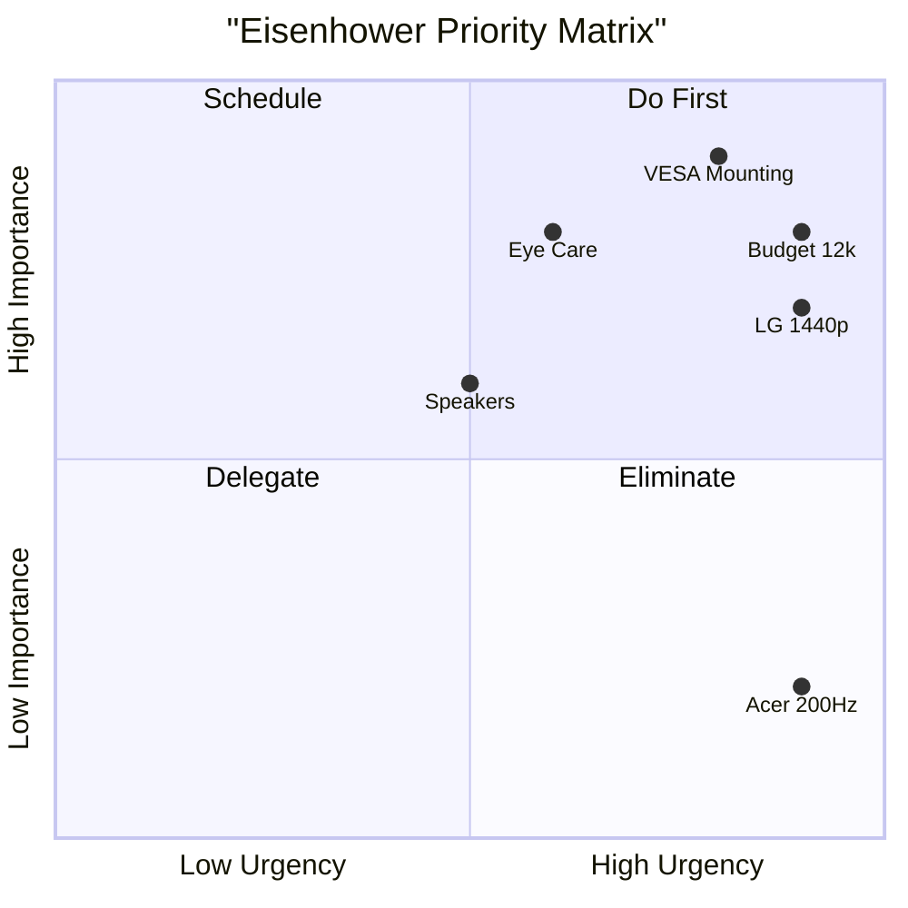
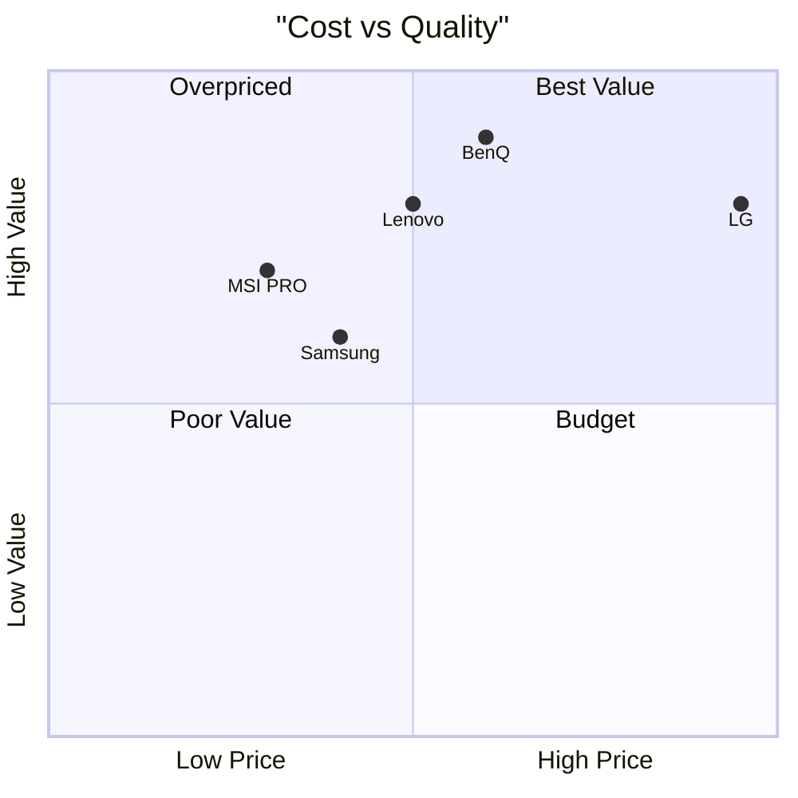
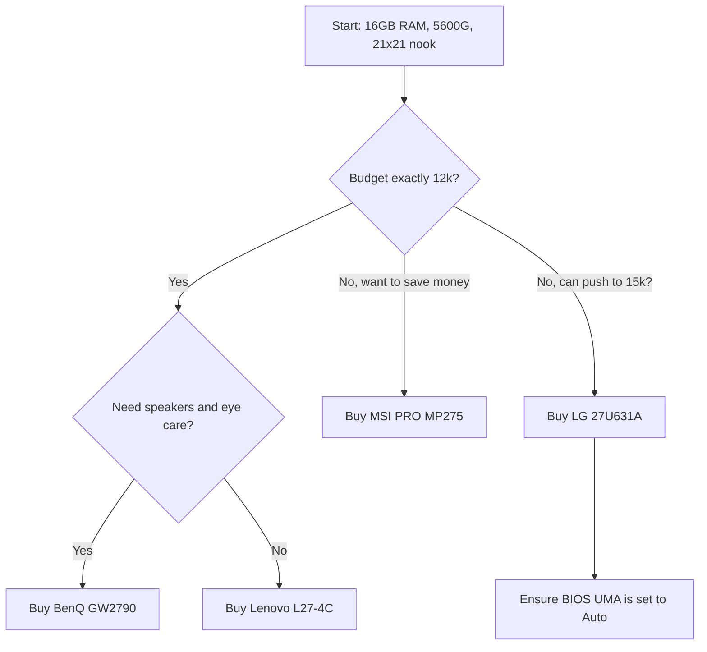

# 🏁 Final Verdict: Corrected Edition

> [!IMPORTANT]
> **Project Status: FINAL DECISION**  
> **System:** AMD Ryzen 5 5600G | 2 × 8 GB ADATA XPG DDR4 (16 GB)  
> **Physical constraint:** ~21 × 21 inch desk/nook area  
> **Budget cap:** ₹12,000 INR  
> **Primary use:** Cybersecurity/GRC work, productivity, browsing, documents, video streaming  
> **Gaming:** Not a requirement | **Mounting:** VESA mandatory

---

## 1. The Revised Executive Decision

### 🏆 FINAL PURCHASE: **BenQ GW2790**

**The LG 27U631A-B is technically the superior display. The BenQ is the superior purchase under the ₹12,000 constraint.**

The LG is *not* disqualified because of RAM limitations. It is disqualified because **it exceeds the hard budget cap** (₹14,999 > ₹12,000).  
If the budget later increases to ~₹15,000, the LG should be reconsidered.

---

## 2. The "RAM Killer" Myth Busted

We previously assumed the LG "mandated" a 2–4 GB RAM allocation, making it a RAM killer. This was incorrect.

- **The Truth:** The monitor does **not** control RAM allocation. The `UMA Frame Buffer Size` is a **BIOS/system configuration** setting.  
- **AMD's Guidance:** AMD officially recommends leaving the UMA frame buffer on **Auto** for most workloads. It is not a property of the LG monitor.

---

## 3. Real-World Hardware Investigation (Your Task Manager Data)

> [!NOTE]
> **Your actual system data:** Installed RAM 16.0 GB | **Usable: 13.9 GB** | **Hardware Reserved: 2.1 GB**

Your concern about RAM was not imaginary—**you are already losing 2.1 GB before you even buy a monitor.** This is *likely* due to your current BIOS UMA setting (possibly set to 2G) and other system hardware (like your VMware adapters).

**The important distinction:** Connecting a 1440p LG will not automatically force the system to reserve 2GB or 4GB of *new* memory for the monitor. The GPU may dynamically use shared memory when applications need it, but it does not permanently lock 4GB just because it is 1440p.

**Your current workload:** With 9.9 GB In Use and only 4.0 GB Available, your system is already tight. But the LG **will not** make this worse. The BenQ simply provides the safest headroom without requiring any BIOS tweaking.

---

## 4. Can We Run the LG at 1080p / 60Hz?

Yes, technically possible.

- **1080p:** You can change the resolution to 1920×1080, but this causes non-integer scaling and makes the picture look soft. It is **not** recommended as a workaround.  
- **60Hz:** You can drop from 100Hz to 60Hz. But 100Hz makes scrolling and UI animations feel smoother and is excellent for desktop work.

**Better strategy:** Keep the monitor at its native 1440p and 100Hz if you buy the LG. For video editing, reduce preview quality or use proxies instead of dropping the desktop resolution.

---

## 5. Complete Final Candidate Comparison

| Monitor | Resolution | Size | Refresh | PPI | Speakers | VESA | Budget Status |
|---|---:|---:|---:|---:|---|---:|---|
| **LG 27U631A-B** | 2560×1440 | 27" | 100 Hz | 109 | No | Yes* | ❌ **Over Budget** |
| **MSI PRO MP275** | 1920×1080 | 27" | 100 Hz | ~82 | Yes | Yes | 🟢 Budget Alternative |
| **Lenovo L27-4C** | 1920×1080 | 27" | 144 Hz | ~82 | Yes | Yes | 🟢 Strong Contender |
| **Samsung Essential S3** | 1920×1080 | 22" | 120 Hz | ~100 | No | Yes | 🟢 Value Dependent |
| **BenQ GW2790** | 1920×1080 | 27" | 100 Hz | ~82 | 2×2W | 100×100 | 🏆 **WINNER** |

---

## 6. Corrected Weighted Decision Matrix

> [!WARNING]  
> **Mandatory Gates:** VESA support and RAM/iGPU compatibility must pass before scoring.

| Criterion | Weight | Why it matters |
|---|---:|---|
| Productivity / Workspace | 20% | Primary use |
| Text Clarity | 15% | Long reading sessions |
| Eye Comfort | 15% | Long hours |
| Value for Money | 15% | ₹12k hard cap |
| Refresh Rate | 10% | Smooth desktop use |
| Video / Editing Suitability | 10% | Secondary workload |
| Connectivity | 5% | Useful but not decisive |
| Speakers | 5% | Convenience only |

---

## 7. Eisenhower Priority Matrix (replaced non-standard mermaid)


---

## 8. Cost vs Quality (replaced non-standard mermaid)

---

## 9. Flowchart (kept as a single standard Mermaid block)



Notes:
- GitHub supports standard mermaid types (flowchart, sequenceDiagram, gantt, classDiagram, etc.) in fenced ```mermaid blocks. Keep to a small number of mermaid blocks and only standard diagram types for best reliability.
- Avoid custom/third-party mermaid extensions such as `quadrantChart` unless you render images externally.

---

## 10. Final Purchase Checklist

- [ ] Confirm final BenQ GW2790 price is ≤ ₹12,000.  
- [ ] Confirm 100×100 VESA support.  
- [ ] Measure the physical nook to accommodate 27" width.  
- [ ] Use the motherboard's video output (5600G iGPU).  
- [ ] Keep BIOS UMA Frame Buffer on Auto unless there is a specific problem.  
- [ ] After installation, verify Windows reports expected usable memory.  
- [ ] Keep 100Hz if the connection supports it.

---

## 11. Sources

- AMD — Configuring UMA Frame Buffer Size  
- LG India — 27U631A-B  
- BenQ India — GW2790 Specifications

---

Decision status: COMPLETE

Current recommendation: BENQ GW2790  
Primary rejection reason for LG: OVER BUDGET — NOT RAM.
