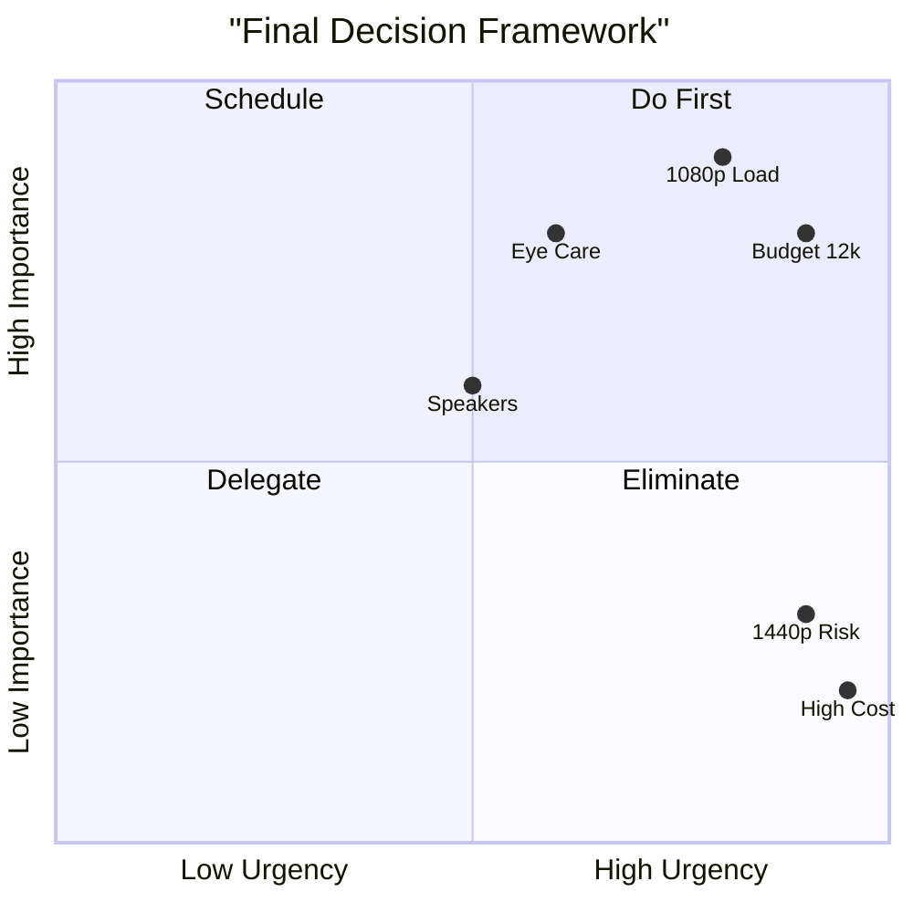

# 🛡️ Final Analysis: RAM Reality & Eye Health

> **Project Conclusion**
> This file serves as the final technical clarification and feature comparison that concluded the monitor research project. It addresses the primary concern (System RAM) and the secondary concern (Long-term Eye Health) to solidify the final recommendation.

---

## Part 1: The RAM Myth & Reality (Breaking it down)

### The Core Confusion
Many believed the LG 27U631A-B was a "RAM killer" because it requires a 2-4 GB VRAM allocation. **This is technically false.**

### The 3-Step Breakdown
1. **The Monitor is Dumb:** The LG is just a screen. It sends a video signal. It cannot physically take RAM away from your system.
2. **The BIOS is the Boss:** The RAM allocation is controlled by the **UMA Frame Buffer Size** setting in your Motherboard's BIOS. AMD recommends leaving this on **"Auto"** for most workloads.
3. **Your Existing Reality:** Your Task Manager shows **16 GB Installed, but 13.9 GB Usable (2.1 GB already reserved)**. This means your BIOS is already set to reserve memory *right now*.

### The Real Risk (Why the BenQ wins)
If you leave the BIOS on Auto, the LG's 1440p desktop will only use a tiny amount of shared memory. **However**, your current system is already running tight at **9.9 GB used and only 4.0 GB available** due to heavy workflows (VMware, VS Code, etc.). 

Choosing the **BenQ GW2790** provides the safest headroom:
- It runs natively at 1080p, which is the lightest possible load on your iGPU.
- It completely removes the temptation to use 1440p, avoiding any dynamic shared memory spikes.
- It doesn't require you to touch the BIOS at all.

---

## Part 2: Eye Health Deep Dive (BenQ vs. LG)

| Feature | BenQ GW2790 (Eye-Care Suite) | LG 27U631A-B (Reader Mode) |
| :--- | :--- | :--- |
| **Flicker Reduction** | Flicker-Free Technology (Eliminates flicker at all brightness levels) | Flicker Safe (Reduces invisible flickering) |
| **Blue Light Filter** | Low Blue Light Plus (Filters harmful blue-violet light while keeping colors vivid) | Reader Mode (Reduces blue light and adjusts color temperature) |
| **Adaptive Brightness** | Brightness Intelligence (B.I. Gen2) with ambient light sensor | **None** (No auto-adjustment) |
| **Reading/Coding Modes** | **Yes** — Dedicated Coding & ePaper modes | No specific coding modes |
| **Health Certifications** | TÜV Rheinland Certified & Eyesafe 2.0 | Not specified in these sources |

### 👁️ Why BenQ Wins on Health
The BenQ takes a "proactive" approach to comfort. The **Brightness Intelligence Sensor** adjusts the screen based on ambient light in your nook (crucial for dark rooms), while the **Coding Mode** is specifically designed to reduce eye strain during long coding sessions. The LG covers the basics, but lacks the adaptive sensor.

---

## Part 3: Final Feature Priority Matrix (Eisenhower)

**Interpretation:** The BenQ (Budget, Eye Care, 1080p Load) sits in the top-right "Do First" quadrant. The LG's high cost and 1440p risk sit in the bottom-right "Eliminate" quadrant for this specific project.

---

## Part 4: Final Verdict Summary

| Aspect | Winner | Reason |
| :--- | :--- | :--- |
| **System RAM Safety** | BenQ GW2790 | Low 1GB VRAM usage, native 1080p, zero BIOS tweaking |
| **Eye Health** | BenQ GW2790 | B.I. Gen2 sensor, Coding Mode, TÜV Certified |
| **Budget Cap** | BenQ GW2790 | Priced at exactly ₹12,000 |
| **Overall Value** | BenQ GW2790 | The perfect balance of features for the 5600G system |

> [!IMPORTANT]
> **Final Status: COMPLETE.**
> **Current Recommendation: BENQ GW2790.**
> **Primary rejection reason for LG: OVER BUDGET, and current system memory headroom is too low. It is NOT a monitor-driven RAM limitation.**
